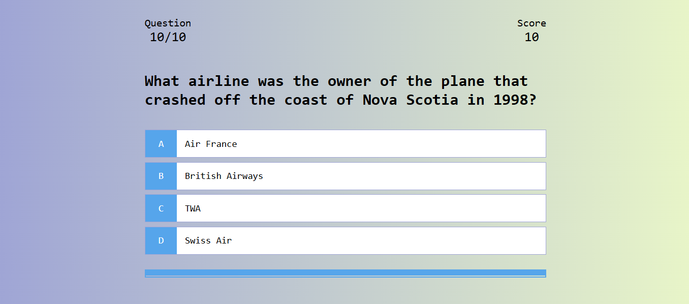

# 🧠 Quiz App

A simple and interactive **Quiz Application** built with **HTML, CSS, and JavaScript**.  
The app fetches questions from the [Open Trivia Database API](https://opentdb.com/) and allows users to test their general knowledge with multiple-choice questions.

---

## 🚀 Features

- 🎲 Fetches random quiz questions from an external API (OpenTDB).
- 📖 Multiple-choice format with 4 options per question.
- ⏳ Tracks question progress with a counter and progress bar.
- ✅ Immediate feedback for correct and incorrect answers.
- ⭐ Score system with points awarded for correct answers.
- 💾 Saves the most recent score in **localStorage**.
- 🔄 Randomized answer choices every time.
- 🎮 Game flow: Start → Answer Questions → End Screen with score.

---

## 🛠️ Tech Stack

- **HTML5** – Structure
- **CSS3** – Styling
- **JavaScript (Vanilla JS)** – Game logic, API integration

---

## 📷 Screenshots

---
